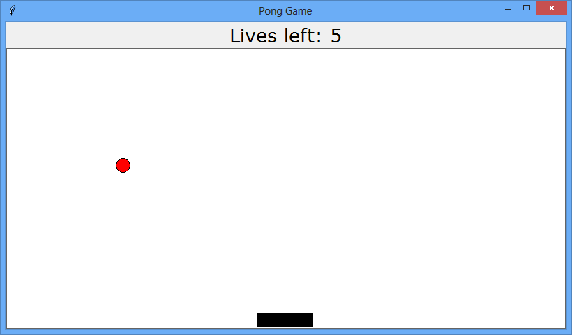
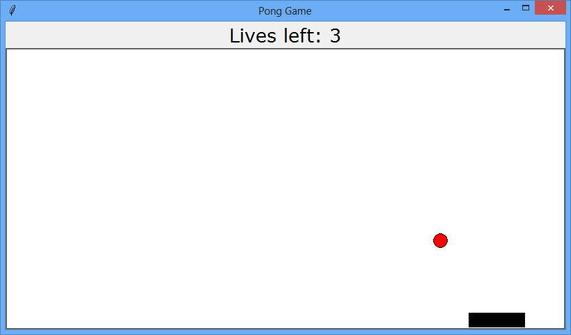
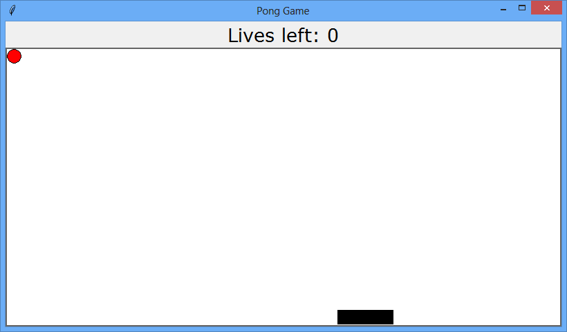

# CSC131: Computational Thinking 
## Homework Assignment # 5
**Due: Monday, April 1st**

**Note:** Due to the nature of this program, this homework assignment will be graded manually, and thus we will **NOT** allow multiple attempts. Instead, the program will be graded once for some score out of 10 points.

For this assignment, you will start with your solution for [lab 8](../../labs/lab_8.md) (the bouncing ball lab) to implement a simple pong game with interface as shown in the following figure.

#### Requirements
 * Add a label at the top with the same width as the canvas and with a non-default font to show the number of lives left until the game is over. 
     * Notice that the ordinarily the width attribute sets a label's width in characters. Using a negative value sets the width in pixels. 
     * The diagram above uses a Verdana 20pt font but you may use any font as long as it is different from tkinter's default font.
     * Start the game with 5 lives.
 * Draw a paddle at the center of the canvas' bottom edge as shown in the above diagram. 
     * The paddle's width and height are 80 and 20 pixels, respectively. 
     * Whenever the user presses the left arrow button, the paddle moves 5 pixels to the left. 
     * Likewise, when the user presses the right arrow bottom, the paddle moves 5 pixels to the right. 
     * The paddle never moves beyond the right or left edges of the canvas.
 * Every time the ball hits the paddle, it will bounce off the top of the paddle. 
     * Notice that a collision between the paddle and the ball occurs when any part of the ball hits the top surface of the paddle. 
 * Every time the ball hits the bottom wall, the player loses a life and the number of lives left is updated on the label. 
     * As long as the player has lives remaining, the ball should be returned to the top of the screen (any X position is okay) where it will resume its movement as normal.
 * The game will end when number of lives left is 0. 
     * When the game ends, move the ball to its initial position near the top left corner of the canvas and end its movement.

Use the following example pictures for reference when making the game.

Please give your main program the name `hw5.py`. Use comments to document and explain your code where needed and use descriptive variable names. Make sure to upload an electronic copy of your source code in a folder called `HW\hw5` in your CSC 131 TRACE folder. You may find it useful to break this program into multiple files. If you do, ensure that all files are uploaded to trace and that running the file named `lab5.py` starts the pong game as expected. Write your name and TRACE folder name at the top of all files.
