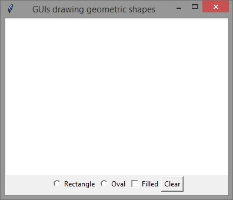
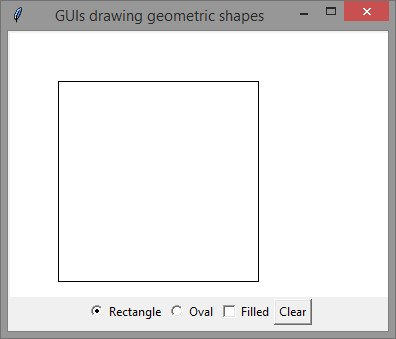
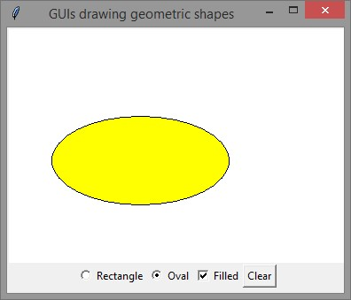
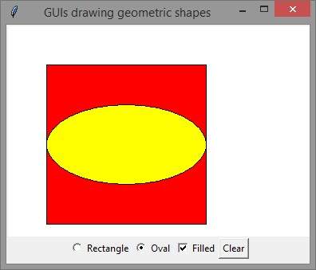

# CSC 131 - Computational Thinking
## Lab 7

Write a GUI program that draws a rectangle and/or an oval, as shown in the figures below. The user selects a figure from a radio button and specifies whether it is filled by selecting a check button. A regular button is used to clear all drawings on the canvas. 
 * When the Rectangle radio button is clicked, the program checks if the Filled check button is checked to decide whether or not the rectangle should be filled. 
     * It then draws a rectangle with top_left corner at (50,50) and bottom_right corner at (250,250). 
 * When the oval radio button is clicked, the program checks if the Filled check button is checked to decide whether or not the oval should be filled. 
     * It then draws an oval "bounded by an imaginary rectangle" with corners at (50,100) and (250, 200). 
 * Use red fill color for the rectangle and yellow fill color for the oval. 
 * When the Clear button is clicked, all drawing on the canvas will be cleared and all buttons will be unchecked.

**NOTE:** Use nested frames to achieve the shown layout where all buttons are added to a pane/frame that is added to the main frame.  

Name your file `lab7.py`. Make sure to include your name and the name of your TRACE folder at the top of the file in a docstring. When you are done, demonstrate your code to the instructor. Make sure to upload an electronic copy of your solution in your CSC131 upload folder in a folder named `LABS\lab7`.

 

Note: The final drawing resulted from the user clicking the Filled check button, followed by clicking the Rectangle radio button, followed by  clicking the oval radio button.
